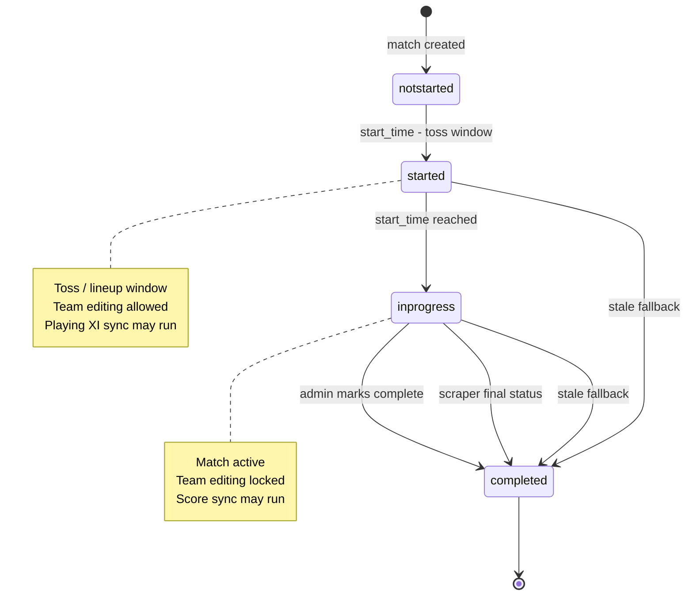
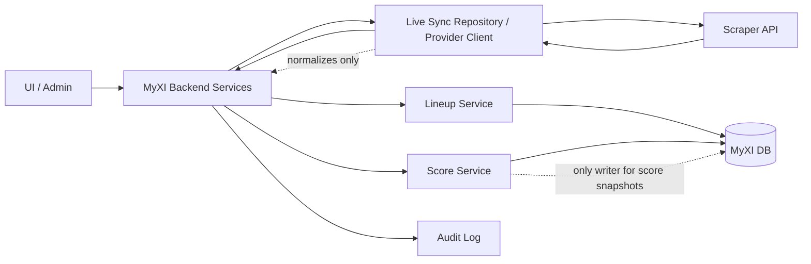
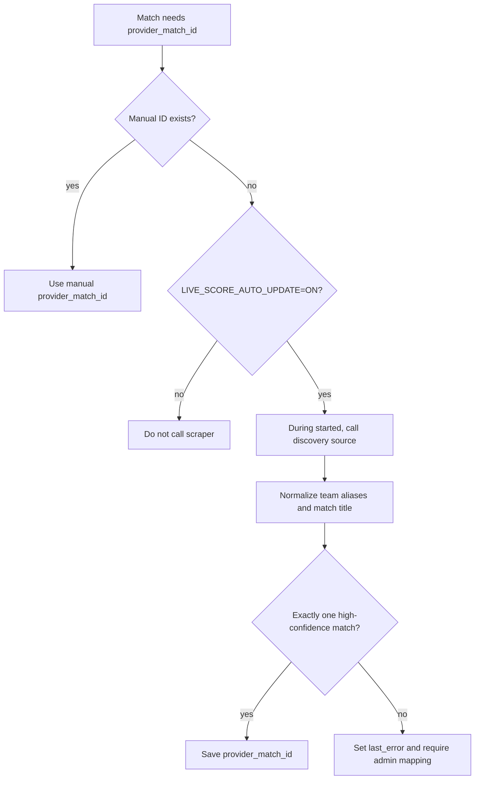
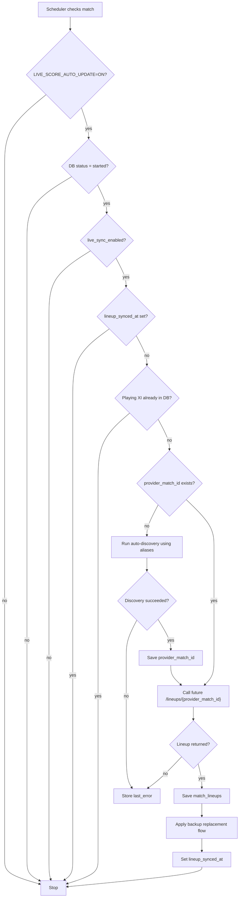
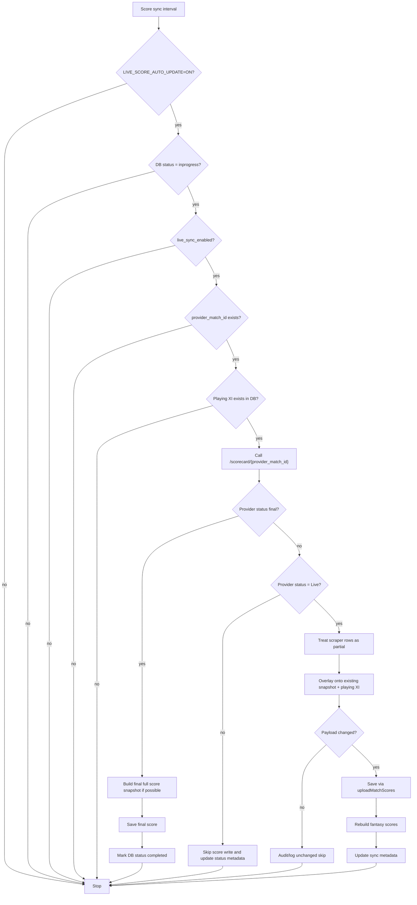
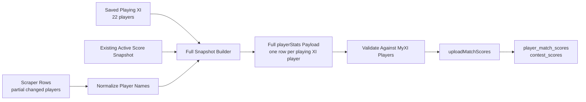
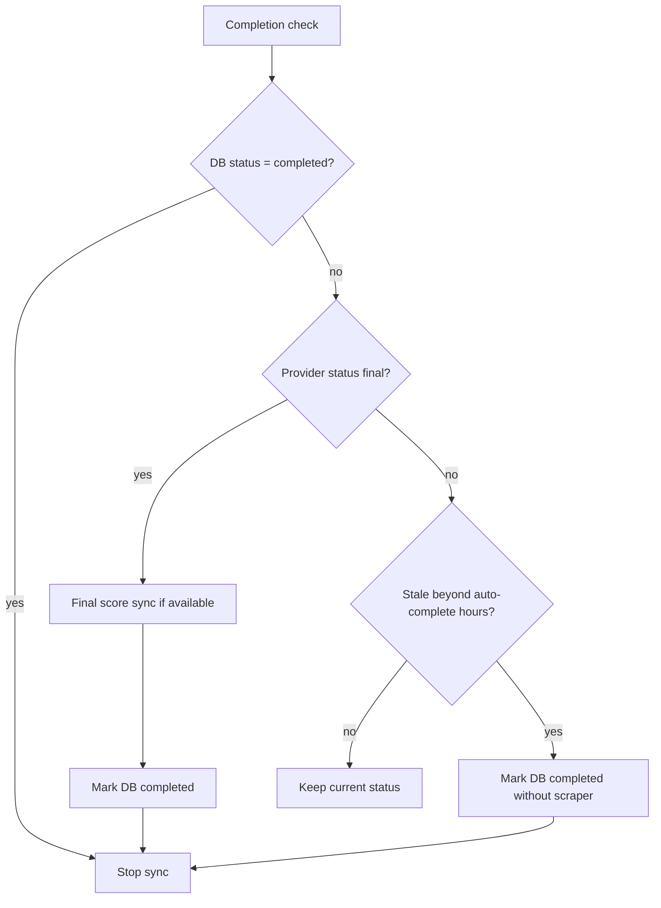
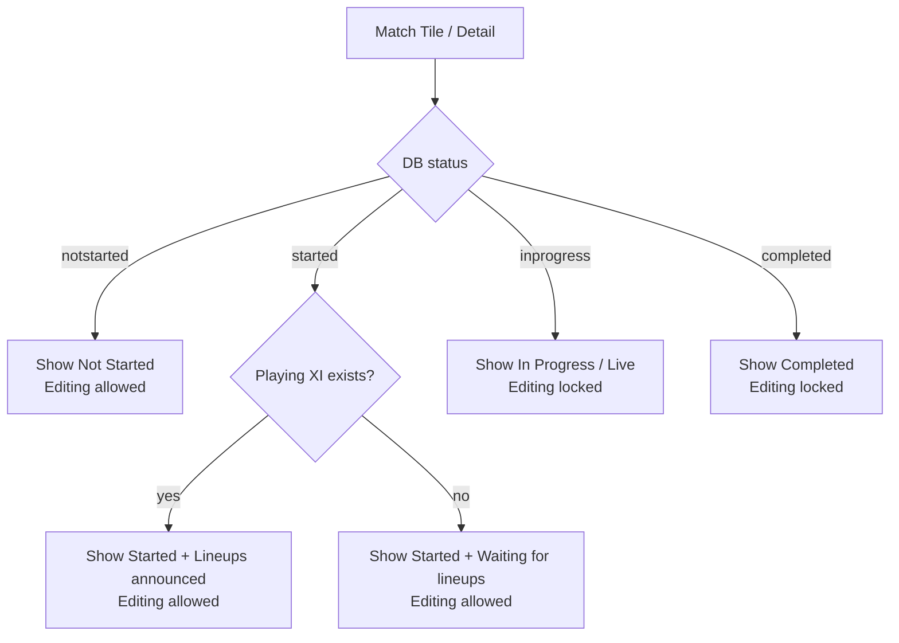

# Live Score Sync Design

## Purpose

MyXI should automatically use scraper data for playing XI and live scores without replacing the existing manual admin score flow.

The backend owns all automatic sync behavior. The UI may display status and later expose admin controls, but user page loads must not be responsible for keeping scores current.

## Design Decisions

- Automatic scraper calls are controlled by `LIVE_SCORE_AUTO_UPDATE`.
- Scraper match IDs are stored separately from core match data.
- Match status gets a new pre-match state: `started`.
- Users can still edit teams during `started`.
- Team editing is locked only when status is `inprogress` or `completed`.
- Playing XI sync runs only during `started`.
- Score sync runs only during `inprogress`.
- Score sync requires playing XI to exist in the DB.
- Every scraper scorecard response is treated as partial input.
- MyXI always builds a full `playerStats` payload before saving.
- Completion can come from MyXI DB status, scraper final status, admin action, or stale internal fallback.
- Manual score upload remains supported and unchanged.

## External Scraper API

Current endpoints:

- `GET /matches/live`
- `GET /matches/recent`
- `GET /matches/upcoming`
- `GET /scorecard/{matchId}`

Future endpoint assumed for this design:

- `GET /lineups/{matchId}` or equivalent playing XI endpoint

Known scraper status examples:

- `Preview`
- `Upcoming Match`
- `Live`
- `In Progress`
- `Complete`
- `SRH Won`
- `GT Won`

Only scraper status `Live` should trigger recurring score writes.

Completion detection:

- `Complete` means completed.
- `Completed` means completed.
- A whole-word `Won` means completed.
- `WonXI` alone does not mean completed.
- `WonXI Won` does mean completed.

## Environment Variables

```env
LIVE_SCORE_API_URL=https://livescoreapi.azurewebsites.net/api
LIVE_SCORE_AUTO_UPDATE=OFF
LIVE_SCORE_PROVIDER_LIVE_STATUS=Live
LIVE_SCORE_AUTO_COMPLETE_AFTER_HOURS=24
```

Rules:

- `LIVE_SCORE_AUTO_UPDATE=ON` enables automatic scraper provider calls.
- `LIVE_SCORE_AUTO_UPDATE=OFF` disables automatic scraper provider calls.
- `/live-score/sync-now` returns disabled status when auto update is `OFF`; manual flow continues.
- `LIVE_SCORE_AUTO_COMPLETE_AFTER_HOURS` is an internal MyXI DB cleanup rule. It is not a scraper setting and does not require a scraper call.

## Match Lifecycle

Internal statuses:

| Status | Meaning | Team Editing | Scraper Behavior |
| --- | --- | --- | --- |
| `notstarted` | Before toss window | Allowed | No recurring sync |
| `started` | Toss / lineup window | Allowed | Playing XI sync only |
| `inprogress` | Match start time reached | Locked | Score sync |
| `completed` | Match finished | Locked | No sync |

Timing:

- `start_time - 30 minutes`: `notstarted -> started`
- `start_time`: `started -> inprogress`
- admin marks complete, scraper final status, or stale fallback: `completed`

Stale fallback:

- If a match remains `started` or `inprogress` after `start_time + LIVE_SCORE_AUTO_COMPLETE_AFTER_HOURS`, MyXI should mark it `completed`.
- This is DB-only cleanup.
- It should not call the scraper.
- It may run as a scheduled job and may also run opportunistically when match list/detail data is fetched.
- If done during a read endpoint, the write should be fire-and-forget/non-blocking so match list/detail endpoints do not become slow.

### Lifecycle Diagram



## Data Model

Do not add scraper-specific operational fields directly to `matches`. Add a separate table:

```sql
create table match_live_syncs (
  match_id bigint primary key references matches(id) on delete cascade,
  provider text not null default 'cricbuzz',
  provider_match_id text,
  live_sync_enabled boolean not null default true,
  lineup_synced_at timestamptz,
  last_score_sync_at timestamptz,
  last_provider_status text,
  last_error text,
  created_at timestamptz not null default now(),
  updated_at timestamptz not null default now()
);
```

Field meanings:

- `provider_match_id`: scraper match ID.
- `live_sync_enabled`: per-match switch for automatic sync.
- `lineup_synced_at`: set once playing XI is saved.
- `last_score_sync_at`: last successful score sync time.
- `last_provider_status`: most recent scraper status observed.
- `last_error`: latest admin-safe sync error.

`matches.source_key` can remain for backward compatibility, but new live sync should prefer `match_live_syncs.provider_match_id`.

## API Response Shape

Match APIs should include live sync metadata for admin/UI:

```js
{
  id,
  name,
  status,
  startTime,
  liveSync: {
    enabled,
    provider,
    providerMatchId,
    lineupSyncedAt,
    lastScoreSyncAt,
    lastProviderStatus,
    lastError
  }
}
```

This should be built with a left join between `matches` and `match_live_syncs`.

## Architecture Boundary

Use a dedicated scraper repository/client layer.

```text
UI/Admin
  -> MyXI backend endpoint/service
    -> live score repository/provider client
      -> scraper API
    <- normalized scraper result
  -> MyXI score/lineup services validate and write to DB
```

The scraper repository/client handles:

- scraper HTTP calls
- provider status normalization
- converting scraper fields into MyXI-shaped DTOs
- returning normalized player rows and status metadata

The MyXI services handle:

- DB reads/writes
- player identity matching
- playing XI persistence
- score validation
- full score snapshot construction
- fantasy score recalculation

The scraper repository must not directly write score snapshots or derived fantasy scores.

### Architecture Diagram



## Provider Match Mapping

Normal recurring sync should not call `/matches/live` once `provider_match_id` exists.

Manual mapping:

- Admin can set `provider_match_id` directly.
- Manual mapping is the fallback path and must be available.

Auto-discovery:

- Auto-discovery is the preferred path during the `started` window.
- Use `/matches/live` sparingly to find the scraper match ID before lineup sync.
- If the future playing XI endpoint can search by teams/date or returns the provider match ID as part of a discovery response, save that ID into `match_live_syncs.provider_match_id`.
- Auto-save `provider_match_id` only when exactly one scraper match passes all required checks.
- After `provider_match_id` is saved, lineup and score sync must call ID-specific endpoints and stop using `/matches/live` for that match.

Team name normalization:

- MyXI may store abbreviations such as `KKR`, `LSG`, `IND`, or `AUS`.
- Scraper may return full names such as `Kolkata Knight Riders`, `Lucknow Super Giants`, `India`, or `Australia`.
- Auto-discovery must use aliases before matching titles.
- Alias sources, in priority order:
  - `team_squads.team_name` for the tournament
  - explicit provider-name normalization inside the live-score integration code
  - small built-in fallback aliases for common teams
- Matching should compare normalized aliases, not raw strings only.

High-confidence rule:

- Both MyXI teams match the scraper title after alias normalization.
- Scraper title contains both normalized teams in any order.
- If scraper start time exists, it is within 12 hours of MyXI `start_time`.
- Provider status is not empty.
- Exactly one scraper match passes these checks.

Do not auto-save when:

- more than one scraper match passes
- only one team matches
- title matching is ambiguous
- confidence is low

Every no-save case should write a short `last_error` explaining why admin mapping is required.

### Provider Mapping Flow



## Playing XI Sync Flow

Runs only during `started`.

Eligibility:

- `LIVE_SCORE_AUTO_UPDATE=ON`
- DB status is `started`
- `live_sync_enabled = true`
- `lineup_synced_at is null`
- no saved playing XI exists for the match in MyXI DB

Flow:

1. Check `match_lineups`.
2. If both teams already have playing XI, set `lineup_synced_at` if missing and skip scraper.
3. If `lineup_synced_at` is already set, skip scraper.
4. If `provider_match_id` is missing, run provider match auto-discovery.
5. If discovery succeeds, save `provider_match_id`.
6. If discovery fails, set `last_error` and stop until admin maps the ID or a later discovery succeeds.
7. Call future scraper playing XI endpoint with `provider_match_id`.
8. Save playing XI into existing match lineup tables.
9. Reuse existing backup replacement flow.
10. Set `lineup_synced_at`.
11. Stop all playing XI scraper calls for that match.

The current scraper Swagger does not expose playing XI. Until it exists, this job should be a no-op or marked unavailable.

### Playing XI Flow Diagram



## Score Sync Flow

Runs through the explicit `/live-score/sync-now` endpoint before UI data refreshes.

Eligibility:

- `LIVE_SCORE_AUTO_UPDATE=ON`
- DB status is `inprogress`
- `live_sync_enabled = true`
- `provider_match_id` exists
- current time is at or after match `start_time`
- playing XI exists in `match_lineups`

Flow:

1. Re-check DB status is `inprogress`.
2. Re-check playing XI exists in `match_lineups`.
3. Call `/scorecard/{provider_match_id}`.
4. If scraper status is not exactly `Live`, skip score write.
5. Treat returned scraper score rows as partial input.
6. Build a full MyXI `playerStats` payload.
7. Save via existing `uploadMatchScores`.
8. Update `last_score_sync_at` and `last_provider_status`.
9. Store any failure in `last_error`.

### Score Sync Flow Diagram



## Partial Score Overlay Rule

Scraper scorecard responses are partial by default.

MyXI must always build a full score snapshot before saving:

1. Load saved playing XI for the match.
2. Load existing active score snapshot for the match.
3. Start a full snapshot with one row per playing XI player.
4. For each playing XI player, use existing active score stats when available.
5. If no existing stats exist, use zero/default stats.
6. Normalize scraper player names against MyXI player identities.
7. Overlay scraper-returned stats onto matching full-snapshot rows.
8. Keep unchanged players from the previous snapshot/default rows.
9. Validate the final full `playerStats` array.
10. Save via `uploadMatchScores`.

Example:

```text
Scraper returns:
  Markram: 10 runs
  Pant: 40 runs

MyXI saved playing XI has 22 players.

Backend builds a 22-player payload:
  Markram row updated to 10
  Pant row updated to 40
  other 20 players keep existing stats or zero/default stats
```

Do not skip overlay because the provider response looks large. Overlay remains the rule unless the scraper contract later adds an explicit `snapshotType: "full"` field and MyXI deliberately supports it.

### Partial Overlay Diagram



## Completion Rules

Auto sync stops when either condition is true:

- MyXI DB status is `completed`
- scraper status indicates completion

Provider completion examples:

- `Complete`
- `Completed`
- `SRH Won`
- `GT Won`
- `INDW Won`

When provider completion is detected:

1. Perform one final score sync if scorecard data is available.
2. Save final score snapshot.
3. Mark MyXI match status `completed`.
4. Stop future sync for that match.

When stale fallback is detected:

1. Do not call scraper.
2. Mark MyXI match status `completed`.
3. Log/audit the stale auto-completion.

### Completion Flow Diagram



## Manual Flow Compatibility

Manual score upload remains unchanged.

Rules:

- Manual upload can overwrite the latest auto-synced score.
- Auto sync can overwrite manual upload while the match is `inprogress` and `live_sync_enabled = true`.
- Admin should disable live sync for a match before applying manual-only corrections.

Recommended admin controls:

- Set scraper/provider match ID.
- Enable/disable live sync per match.
- Fetch lineup now.
- Fetch score now.
- Mark completed.
- Show last sync time, provider status, and last error.

## Idempotency And Concurrency

Multiple sync triggers can happen at the same time, for example scheduled score sync and manual `Fetch Score Now`.

Required behavior:

- Score writes must remain idempotent.
- If normalized score payload is unchanged, skip DB writes and derived rebuilds.
- Scheduled and manual score sync should use the same `uploadMatchScores` path.
- Prefer a per-match in-process lock or DB advisory lock around live score sync.
- If a sync is already running for a match, the second sync should skip or wait briefly rather than duplicate work.

## Failure Handling

For scraper failures:

- write short admin-safe error to `match_live_syncs.last_error`
- log detailed internal error server-side
- do not crash the scheduler
- continue processing other matches

Retry/backoff:

- Exponential backoff and dead-letter handling are intentionally out of scope for the first implementation.
- First implementation should use interval-based retry only.
- This can be revisited if scraper instability becomes a real operational problem.

## Logging And Observability

Use consistent server log prefix:

```text
[live-score]
```

Log these events:

- auto update enabled/disabled at startup
- status transition job started/skipped/completed
- `notstarted -> started`
- `started -> inprogress`
- stale `started/inprogress -> completed`
- provider match mapping attempted/succeeded/failed
- lineup sync attempted/skipped/succeeded/failed
- score sync attempted/skipped/succeeded/failed
- provider returned non-live status and score write was skipped
- provider returned completed status and MyXI was marked completed
- score write skipped because payload is unchanged

Use structured fields:

```js
{
  matchId,
  tournamentId,
  provider,
  providerMatchId,
  dbStatus,
  providerStatus,
  action,
  result,
  reason,
  durationMs
}
```

Do not log full scorecards or full playing XI payloads by default. Log counts instead:

- `playerRows`
- `lineupTeams`
- `updatedContestCount`
- `updatedUserCount`

Audit log events:

- provider match ID manually set
- provider match ID auto-discovered
- playing XI saved from scraper
- live score synced from scraper
- score sync skipped because payload unchanged
- match auto-completed by stale fallback
- match auto-completed from provider final status
- live sync enabled/disabled by admin

## UI Requirements

During `started`:

- show status chip `Started`
- if DB lineups exist, show `Lineups announced`
- if DB lineups do not exist, show `Waiting for lineups`
- use a color distinct from live/inprogress
- keep team editing enabled

During `inprogress`:

- lock team editing
- show live/inprogress status
- score sync may run if all backend gates pass

During `completed`:

- lock team editing
- stop sync

User-facing dynamic score updates are phase 2/3 UI work. Browser sessions should not control backend sync.

### UI State Diagram



## Implementation Checklist

### Phase 1: Data Model

- [ ] Add migration for `match_live_syncs`.
- [ ] Add repository/service methods to read and upsert live sync metadata by `match_id`.
- [ ] Update match fetch APIs to return `liveSync` metadata.
- [ ] Keep `matches.source_key` supported as fallback only.
- [ ] Add tests for match metadata response shape.

### Phase 2: Provider Client

- [ ] Keep `LIVE_SCORE_API_URL` env-driven with no hardcoded fallback.
- [ ] Keep automatic scraper calls gated by `LIVE_SCORE_AUTO_UPDATE=ON`.
- [ ] Create scraper repository/client module.
- [ ] Add provider methods:
  - `getLiveMatches()`
  - `getScorecard(providerMatchId)`
  - `getPlayingXi(providerMatchId)` as future/no-op until scraper supports it
- [ ] Normalize provider statuses.
- [ ] Detect whole-word `Won`.
- [ ] Add unit tests for status normalization and casing.

### Phase 3: Match Status Transitions

- [ ] Add `started` as an allowed match status.
- [ ] Add env var:
  - `LIVE_SCORE_AUTO_COMPLETE_AFTER_HOURS`
- [ ] Implement DB-only transition job:
  - `notstarted -> started` at `start_time - 30 minutes`
  - `started -> inprogress` at `start_time`
  - stale `started/inprogress -> completed` after fallback window
- [ ] Add non-blocking opportunistic stale-complete check when fetching match list/detail.
- [ ] Ensure stale auto-complete does not call scraper and does not depend on `LIVE_SCORE_AUTO_UPDATE`.
- [ ] Update UI/team-lock logic so `started` remains editable.
- [ ] Lock team editing only for `inprogress` and `completed`.
- [ ] Add tests for status transitions and editability.

### Phase 4: Provider Match Mapping

- [ ] Add admin API to set `provider_match_id` manually.
- [ ] Add auto-discovery service for `started` matches using `/matches/live` or future lineup discovery response.
- [ ] Add team alias map for abbreviated MyXI names versus full scraper names.
- [ ] Normalize team names before title matching.
- [ ] Auto-save only when exactly one provider match passes high-confidence checks.
- [ ] Do not auto-save ambiguous/partial matches.
- [ ] Store low-confidence failures in `last_error`.
- [ ] Log mapping attempts, successes, and failures.
- [ ] Add audit log row when provider match ID is manually set or auto-discovered.
- [ ] Ensure normal score sync does not call `/matches/live` once `provider_match_id` exists.
- [ ] Add tests for manual mapping and no-provider-ID behavior.

### Phase 5: Playing XI Sync

- [ ] Add future provider method `getPlayingXi(providerMatchId)`.
- [ ] Create lineup sync job for `started` matches only.
- [ ] Before scraper call, check whether playing XI already exists in `match_lineups`.
- [ ] If playing XI exists, set `lineup_synced_at` if missing and skip scraper call.
- [ ] Skip lineup sync when `lineup_synced_at` is already set.
- [ ] If `provider_match_id` is missing, run provider match auto-discovery before lineup fetch.
- [ ] Save discovered `provider_match_id` before calling lineup endpoint.
- [ ] Stop lineup sync and write `last_error` if provider match ID cannot be discovered.
- [ ] Save playing XI into existing lineup tables.
- [ ] Reuse existing backup replacement flow after lineup save.
- [ ] Set `lineup_synced_at` after success.
- [ ] Stop playing XI scraper calls once DB lineups are saved.
- [ ] Stop playing XI scraper calls once match status changes to `inprogress`.
- [ ] Store scraper errors in `last_error`.
- [ ] Log lineup sync attempts, DB-lineup skip, success, and failure.
- [ ] Add audit log row when playing XI is saved from scraper.
- [ ] Add tests for one-time lineup sync and DB-lineup skip behavior.

### Phase 6: Score Sync

- [ ] Implement score sync job gated by:
  - `LIVE_SCORE_AUTO_UPDATE=ON`
  - DB status `inprogress`
  - `live_sync_enabled = true`
  - `provider_match_id` exists
  - current time >= `start_time`
  - playing XI exists in `match_lineups`
- [ ] Fetch `/scorecard/{provider_match_id}` every configured interval.
- [ ] Only update score when provider status is exactly `Live`.
- [ ] Treat every scraper scorecard response as partial input.
- [ ] Build full `playerStats` snapshot from saved playing XI plus existing active score snapshot.
- [ ] Overlay scraper-returned player rows onto matching MyXI player rows.
- [ ] Add zero/default rows for missing playing XI players.
- [ ] Save through existing `uploadMatchScores`.
- [ ] Skip DB writes when normalized score payload is unchanged.
- [ ] Add audit log row when score sync is skipped because payload is unchanged.
- [ ] Update `last_score_sync_at` and `last_provider_status`.
- [ ] Store errors in `last_error`.
- [ ] Add tests for unchanged-score skip and successful score sync.

### Phase 7: Completion Handling

- [ ] Stop sync when DB status is `completed`.
- [ ] Detect provider completion:
  - `Complete`
  - `Completed`
  - whole-word `Won`
- [ ] On provider completion, perform one final score sync if scorecard is available.
- [ ] Mark DB match status `completed`.
- [ ] Stop future sync for that match.
- [ ] Add stale fallback completion after configured hours.
- [ ] Log provider-completed and stale-completed transitions.
- [ ] Add audit log row when match is auto-completed.
- [ ] Add tests for provider-completed and stale-completion paths.

### Phase 8: Admin Controls

- [ ] Add admin view for live sync metadata.
- [ ] Add provider match ID editor.
- [ ] Add per-match live sync enable/disable toggle.
- [ ] Add manual `Fetch Lineup Now`.
- [ ] Add manual `Fetch Score Now`.
- [ ] Add `Mark Completed`.
- [ ] Show last sync time, provider status, and last error.
- [ ] Show short admin-safe sync error from `last_error`.
- [ ] Add audit log visibility for scraper sync actions.
- [ ] Add Playwright E2E coverage for admin controls.

### Phase 9: Logging And Monitoring

- [ ] Create shared live-sync logger helper with `[live-score]` prefix.
- [ ] Add duration timing around provider calls and DB write phases.
- [ ] Ensure logs include match ID, tournament ID, provider match ID, DB status, and provider status.
- [ ] Ensure logs never print full scorecard payloads by default.
- [ ] Store latest failure in `match_live_syncs.last_error`.
- [ ] Add audit log entries for important live-sync state changes.
- [ ] Add tests for last-error persistence on provider failure.

### Phase 10: UI Live Updates

- [ ] During `started`, show pre-match state on match tiles/details.
- [ ] Show `Lineups announced` in a distinct color when DB lineups exist.
- [ ] Show `Waiting for lineups` when status is `started` but no DB lineup exists.
- [ ] Keep team editing enabled during `started`.
- [ ] Add user-facing dynamic refresh later.
- [ ] Do not make browser sessions responsible for backend score sync.
- [ ] Reuse existing API score/leaderboard outputs.
- [ ] Add cache invalidation or polling strategy for contest/leaderboard pages.
